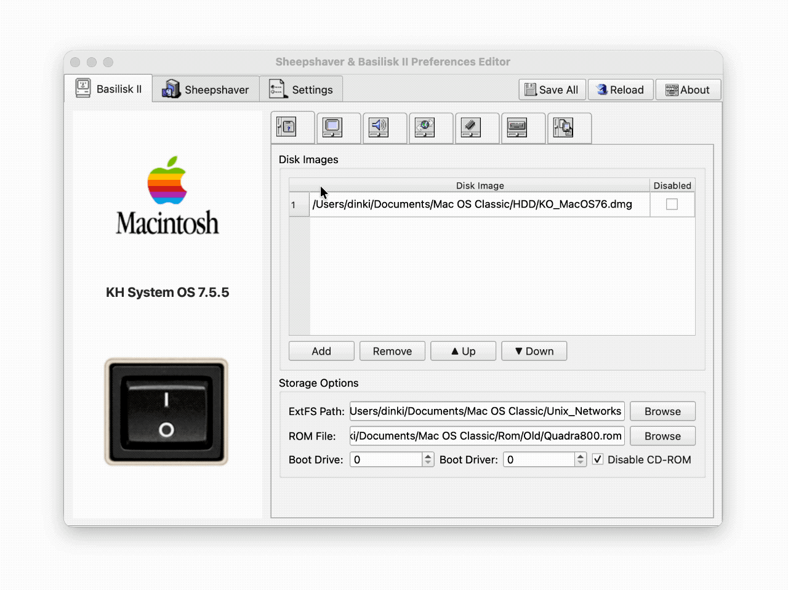
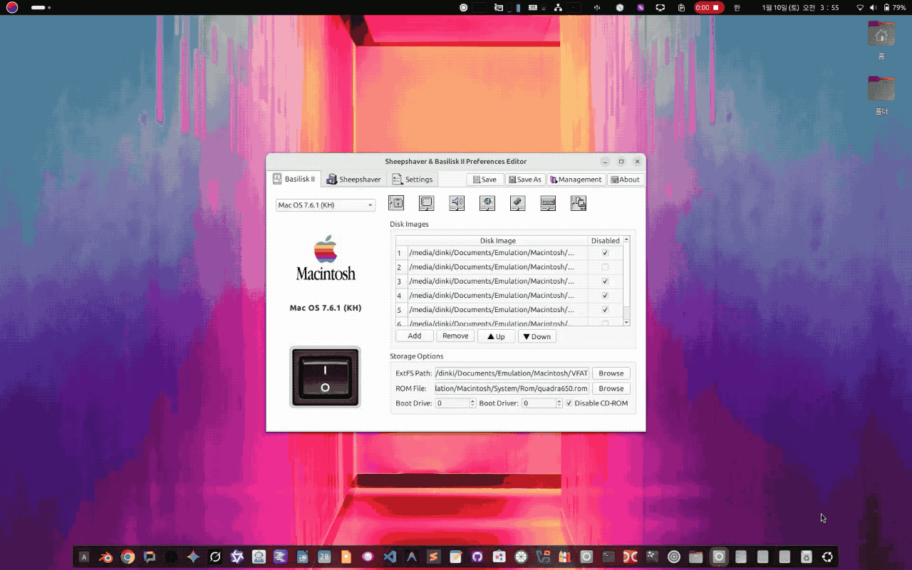

# Sheepshaver & Basilisk II Preferences Editor

A cross-platform GUI application for editing Sheepshaver and Basilisk II emulator configuration files.


## Features

- **Tabbed Interface**: Separate tabs for Basilisk II and Sheepshaver configurations
- **Comprehensive Settings**: 8 sub-tabs covering all emulator options
  - 💾 Drives: Disk images (add/remove/reorder), ExtFS, ROM, boot options
  - 🖥️ Graphics: Screen mode, resolution, scaling, renderer
  - 🔊 Sound: Enable/disable, buffer, devices
  - 🌐 Network: Ethernet mode, UDP tunnel
  - ⚡ CPU/Memory: RAM size, CPU type, JIT options
  - ⌨️ Input: Keyboard, mouse, keycodes
  - 📡 Serial: Serial port configuration
  - ⚙️ Misc: GUI, clipboard, time offset
- **Emulator Launch**: Run emulators directly from the app
- **Cross-Platform**: Works on Linux, macOS, and Windows

## Internationalization (i18n)

The application supports multiple languages. You can change the language in the **Settings** tab.
- 🇺🇸 English
- 🇰🇷 Korean (한국어)
- 🇨🇳 Chinese (简体中文)

*Note: You need to restart the application to apply language changes.*

## Profile Management

Manage multiple configuration profiles easily for different use cases (e.g., OS 7.x, OS 9, Gaming).

- **Management Button**: Click "Management" (top-right) to open the profile manager.
- **Filtering**: View profiles for All, Basilisk II, or SheepShaver.
- **Duplicate**: Quickly clone an existing profile to test new settings safely.
- **Rename/Delete**: Convert filenames (e.g., `.basilisk_ii_gaming_prefs`) to readable names (e.g., `gaming`) automatically.

## Shader Management

Enhance visual quality with GLSL shaders.

- **Shader Stack**: Add multiple shaders to a stack (e.g., CRT simulation + Coloring).
- **Parameter Tuning**:
  - The application parses `#pragma parameter` from GLSL files.
  - Click the **Gear Icon** next to a shader to adjust parameters (e.g., scanline intensity, blur, curvature) via sliders.
  - Parameters are saved per-profile.

## Screenshots





## Requirements

- Python 3.8+
- QtPy
- PyQt6 (or PyQt5/PySide6)

## Installation

### From Source

```bash
# Clone the repository
git clone https://github.com/YourUsername/DINKIssTyle-Sheepshaver-Basilisk-Prefs.git
cd DINKIssTyle-Sheepshaver-Basilisk-Prefs

# Install dependencies
pip install -r requirements.txt

# Run
python main.py
```

### Using uv (Recommended)

```bash
uv run --with qtpy --with PyQt6 python main.py
```

## Building Executables

### Linux
```bash
chmod +x build_linux.sh
./build_linux.sh
# Output: dist/EmulatorPrefs
```

### macOS
```bash
chmod +x build_macos.sh
./build_macos.sh
# Output: dist/EmulatorPrefs.app
```

### Windows
```cmd
build_windows.bat
REM Output: dist\EmulatorPrefs.exe
```

## First-Time Setup

1. Launch the application
2. Go to the **Settings** tab
3. Configure paths:
   - Basilisk II executable and config file paths
   - Sheepshaver executable and config file paths
4. Click **Save Settings**
5. Click **Reload** to load your configurations

## Configuration File Locations

| OS | Basilisk II | Sheepshaver |
|----|-------------|-------------|
| Linux | `~/.basilisk_ii_prefs` | `~/.sheepshaver_prefs` |
| macOS | `~/.basilisk_ii_prefs` | `~/.sheepshaver_prefs` |
| Windows | `%USERPROFILE%\.basilisk_ii_prefs` | `%USERPROFILE%\.sheepshaver_prefs` |

## License

Copyright (C) 2025 DINKI'ssTyle. All rights reserved.

## Author

Created by **DINKIssTyle**
