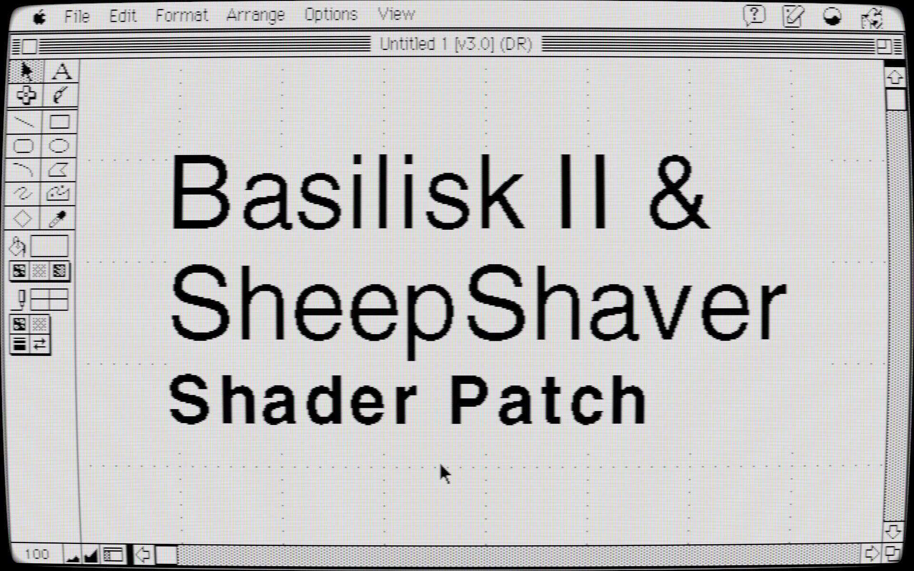

# macemu Shader Patch



**[한국어 설명은 아래에 있습니다](#macemu-쉐이더-패치-korean)**

This patch adds GLSL shader support to the macemu (Basilisk II, SheepShaver) emulators.

---

## 📋 Patch Contents

### Added Features
- **GLSL Shader Rendering** - Apply various effects like CRT, scanlines, etc.
- **Shader Parameter Adjustment** - Real-time adjustment of brightness, contrast, gamma, etc.
- **Hotkey Reload** - Immediate application after settings change (Default: F6)

### Added Configuration Items
| Setting | Type | Description |
|-----|-----|-----|
| `shader` | STRING | GLSL shader file path |
| `shader_params` | STRING | Shader parameters (key=value,...) |
| `key_shader_toggle` | STRING | Shader reload hotkey (e.g., F6) |

---

## 📁 Folder Structure

```
macemu-patch/
├── apply_shader_patch.sh    # Patch application script (English)
├── apply_shader_patch_ko.sh # Patch application script (Korean)
├── README.md                # This file
├── macemu/                  # Original macemu source (Target)
│   ├── BasiliskII/
│   │   └── build.sh         # BasiliskII build script
│   └── SheepShaver/
│       └── build.sh         # SheepShaver build script
└── patches/                 # Patch files
    ├── basilisk_*.patch     # Patches for BasiliskII
    └── sheepshaver_*.patch  # Patches for SheepShaver
```

---

## 🚀 Usage

### 1. Apply Patch

```bash
cd /home/dinki/Desktop/macemu-patch
./apply_shader_patch.sh
```

To patch macemu in a different location:
```bash
./apply_shader_patch.sh /path/to/your/macemu
```

The patch script automatically performs the following:
- Applies patches to shader-related source files
- Modifies `prefs.cpp` buffer size (256 → 4096) to support long `shader_params`
- Generates build scripts: `BasiliskII/build.sh`, `SheepShaver/build.sh`

### 2. Build

**BasiliskII:**
```bash
./macemu/BasiliskII/build.sh
```

**SheepShaver:**
```bash
./macemu/SheepShaver/build.sh
```

### 3. Shader Configuration

Add to your `~/.basilisk_ii_prefs` or `~/.sheepshaver_prefs` file:

```
shader /path/to/shader.glsl
shader_params brightness=1.2,contrast=1.1
key_shader_toggle F6
```

---

## 📦 Patch File List

### BasiliskII
| File | Description |
|-----|-----|
| `basilisk_prefs_items.patch` | Adds shader configuration items |
| `basilisk_configure.patch` | Build configuration (video_shader.cpp, -lGL) |
| `basilisk_video_sdl2.patch` | Shader rendering integration |
| `basilisk_video_shader_cpp.patch` | Shader system implementation (New) |
| `basilisk_video_shader_h.patch` | Shader header (New) |
| `basilisk_prefs_buffer.patch` | Increases prefs.cpp buffer (256→4096) |

### SheepShaver
| File | Description |
|-----|-----|
| `sheepshaver_prefs_items.patch` | Adds shader configuration items |
| `sheepshaver_configure.patch` | Build configuration (video_shader.cpp, -lGL) |
| `sheepshaver_video_sdl2.patch` | Shader rendering integration |
| `sheepshaver_video_shader_cpp.patch` | Shader system implementation (New) |
| `sheepshaver_video_shader_h.patch` | Shader header (New) |

---

## ⚠️ Prerequisites

- **OpenGL Required**: Shader functions require OpenGL.
- **SDL2 Required**: SDL2 video driver is required.
- **Build Dependencies**: `libgl1-mesa-dev`, `libsdl2-dev`, `libgtk-3-dev`, etc.

### Install Dependencies (Ubuntu/Debian)
```bash
sudo apt install build-essential autoconf automake \
  libsdl2-dev libgtk-3-dev libgl1-mesa-dev
```

---

## 📝 Changelog

- **2026-01-10**: Initial patch system established
  - Added shader rendering support
  - Increased prefs.cpp buffer size to 4096 (Support for long shader_params)

<br>
<br>
<br>

---
---

# macemu 쉐이더 패치 (Korean)

Created by DINKIssTyle on 2026. Copyright (C) 2026 DINKI'ssTyle. All rights reserved.

macemu(Basilisk II, SheepShaver) 에뮬레이터에 GLSL 쉐이더 지원을 추가하는 패치입니다.

---

## 📋 패치 내용

### 추가된 기능 
- **GLSL 쉐이더 렌더링** - CRT, 스캔라인 등 다양한 효과 적용 가능
- **쉐이더 파라미터 조절** - 밝기, 대비, 감마 등 실시간 조정
- **핫키 리로드** - 설정 변경 후 즉시 적용 (기본: F6)

### 추가되는 설정 항목
| 설정 | 타입 | 설명 |
|-----|-----|-----|
| `shader` | STRING | GLSL 쉐이더 파일 경로 |
| `shader_params` | STRING | 쉐이더 파라미터 (key=value,...) |
| `key_shader_toggle` | STRING | 쉐이더 리로드 핫키 (예: F6) |

---

## 📁 폴더 구조

```
macemu-patch/
├── apply_shader_patch.sh    # 패치 적용 스크립트 (영어)
├── apply_shader_patch_ko.sh # 패치 적용 스크립트 (한국어)
├── README.md                # 이 파일
├── macemu/                  # 오리지널 macemu (패치 대상)
│   ├── BasiliskII/
│   │   └── build.sh         # BasiliskII 빌드 스크립트
│   └── SheepShaver/
│       └── build.sh         # SheepShaver 빌드 스크립트
└── patches/                 # 패치 파일들
    ├── basilisk_*.patch     # BasiliskII용 패치
    └── sheepshaver_*.patch  # SheepShaver용 패치
```

---

## 🚀 사용 방법

### 1. 패치 적용

```bash
cd /home/dinki/Desktop/macemu-patch
./apply_shader_patch.sh
```

다른 경로의 macemu를 패치하려면:
```bash
./apply_shader_patch.sh /path/to/your/macemu
```

패치 스크립트는 다음을 자동으로 수행합니다:
- 쉐이더 관련 소스 파일 패치 적용
- `prefs.cpp` 버퍼 크기 수정 (256 → 4096, 긴 shader_params 지원)
- `BasiliskII/build.sh`, `SheepShaver/build.sh` 빌드 스크립트 생성

### 2. 빌드

**BasiliskII:**
```bash
./macemu/BasiliskII/build.sh
```

**SheepShaver:**
```bash
./macemu/SheepShaver/build.sh
```

### 3. 쉐이더 설정

`~/.basilisk_ii_prefs` 또는 `~/.sheepshaver_prefs` 파일에 추가:

```
shader /path/to/shader.glsl
shader_params brightness=1.2,contrast=1.1
key_shader_toggle F6
```

---

## 📦 패치 파일 목록

### BasiliskII
| 파일 | 설명 |
|-----|-----|
| `basilisk_prefs_items.patch` | 쉐이더 설정 항목 추가 |
| `basilisk_configure.patch` | 빌드 설정 (video_shader.cpp, -lGL) |
| `basilisk_video_sdl2.patch` | 쉐이더 렌더링 통합 |
| `basilisk_video_shader_cpp.patch` | 쉐이더 시스템 구현 (신규) |
| `basilisk_video_shader_h.patch` | 쉐이더 헤더 (신규) |
| `basilisk_prefs_buffer.patch` | prefs.cpp 버퍼 크기 증가 (256→4096) |

### SheepShaver
| 파일 | 설명 |
|-----|-----|
| `sheepshaver_prefs_items.patch` | 쉐이더 설정 항목 추가 |
| `sheepshaver_configure.patch` | 빌드 설정 (video_shader.cpp, -lGL) |
| `sheepshaver_video_sdl2.patch` | 쉐이더 렌더링 통합 |
| `sheepshaver_video_shader_cpp.patch` | 쉐이더 시스템 구현 (신규) |
| `sheepshaver_video_shader_h.patch` | 쉐이더 헤더 (신규) |

---

## ⚠️ 주의사항

- **OpenGL 필수**: 쉐이더 기능은 OpenGL을 필요로 합니다.
- **SDL2 필수**: SDL2 비디오 드라이버가 필요합니다.
- **빌드 의존성**: `libgl1-mesa-dev`, `libsdl2-dev`, `libgtk-3-dev` 등 필요

### 의존성 설치 (Ubuntu/Debian)
```bash
sudo apt install build-essential autoconf automake \
  libsdl2-dev libgtk-3-dev libgl1-mesa-dev
```

---

## 📝 변경 이력

- **2026-01-10**: 초기 패치 시스템 구축
  - 쉐이더 렌더링 지원 추가
  - prefs.cpp 버퍼 크기 4096으로 증가 (긴 shader_params 지원)


Created by DINKIssTyle on 2026. Copyright (C) 2026 DINKI'ssTyle. All rights reserved.